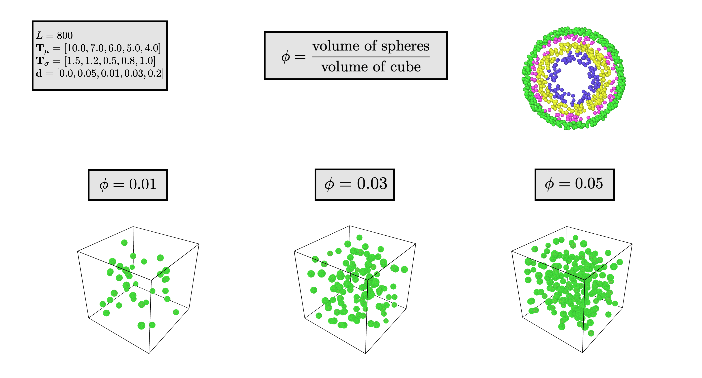

============================
Box with uniform onions
============================

Read about :ref:`onions <uni-onion>` before this

Structural features
----------------------
1. :math:`L` is the length of the box
2. :math:`\phi` is the volume fraction. It is dimensionless. :math:`\phi = \frac{\sum V_{i}}{L^3}`, :math:`V_i` is the volume of sphere :math:`i`
3. :math:`\mathbf{T_\mu}` is a vector that represents the mean thicknesses of each shell.
4. :math:`\mathbf{T_\sigma}` is an vectorthat represents the standard deviation of the thicknesses .
5. :math:`\mathbf{d}` is an vector that represents each shell's density of scatters. 
   Each density is represented in scatters (points) per unit volume.

The distribution of radii
--------------------------

First, create the new standard distribution's for use within the log-normal distrubition

.. math::
  \mathbf{s_T} = \sqrt{\ln \left(1 + \frac{\mathbf{T_\sigma} ^ 2}{\mathbf{T_\mu} ^ 2} \right)} 

Then, create the new mean, 

.. math::
  \mathbf{m_T} = \ln(\mathbf{T_\mu}) - \frac{\mathbf{s_T}^2}{2}

For more information, see the sidebar on `Wikipedia <https://en.wikipedia.org/wiki/Log-normal_distribution>`_

Next, we will create the thicknesses.
We systematically choose each outer and inner radii such that the total volume of the onions does not exceed :math:`\phi L^3`.

**Step 1: Sampling the thickness and radii**

For each iteration :math:`i`, choose the thickness :math:`\mathbf{t}_i` such that

.. math::
  \mathbf{t}_i \sim \text{Lognormal}(\mathbf{m_T}, \mathbf{s_T})

**Step 2: Termination with volume fraction**

After each iteration, calculate the current volume :math:`V = \frac{4}{3} \pi \sum_{j=0}^i t_{ij}`
The total volume :math:`V_{tot}` is updated as well:

.. math::
  V_{tot} \leftarrow V_{tot} + V

This process continues until :math:`V_{tot} > \phi L^3`.

**Step 3: Storing the thicknesses**

The sequence of thicknesses will be stored as a matrix with shape :math:`(K, N)`, with :math:`K` being the number of shells.

.. math::
   \mathbf{T} = \begin{bmatrix}
   t_{11} & t_{12} & \cdots & t_{1K} \\
   t_{21} & t_{22} & \cdots & t_{2K} \\
   \vdots & \vdots & \ddots & \vdots \\
   t_{N1} & t_{N2} & \cdots & t_{NK}
   \end{bmatrix}

Generating the centers
-------------------------

In order to avoid errors in scattering, we use a brute force method to generate the centers.
Let the centers be :math:`\mathbf{C}`, a matrix of shape :math:`(N, 3)` representing each point in :math:`\mathbb{R}^3`.
Let the maximum outer radius of all the spheres by :math:`R_{max} = \max_i(\sum_{j=1}^K t_{ij})`, 
which is the maximum total radius one onion has.

Generate any point :math:`\mathbf{v} = (x, y, z)` by generating it uniformly over :math:`[-\frac{L}{2} + R_{max}, \frac{L}{2} - R_{max}]`.
:math:`\mathbf{v}` must have the property that it is at least a distance :math:`2 R_{max}` from other points. That is, for every 
:math:`\mathbf{p} \in \mathbf{C}`, :math:`\Vert \mathbf{v} - \mathbf{p} \Vert > 2 R_{max}`

Generating each sphere
-----------------------
For every center :math:`\mathbf{c_i} \in \mathbf{C}` generate a :ref:`uniform onion <uni-onion>` :math:`\mathbf{O}`
with thicknesses :math:`\mathbf{T_i}` and densities :math:`\mathbf{d}`. Then, add each point :math:`\mathbf{O} + \mathbf{c_i}` 
(essentially displacing the points from the origin to the center)
to the final structure :math:`\mathbf{S}`.

Example
-----------
**The volume fraction:** :math:`\phi`

  
  A box of onions with varying volume fractions

The range of volume fractions showcase how the number of particles depends on :math:`\phi`. 
We take some features as constants:

.. math::
  L = 800\\
  \mathbf{T}_\mu = [10.0, 7.0, 6.0, 5.0, 4.0]\\
  \mathbf{T}_\sigma = [1.5, 1.2, 0.5, 0.8, 1.0]\\
  \mathbf{d} = [0.0, 0.05, 0.01, 0.03, 0.2]
