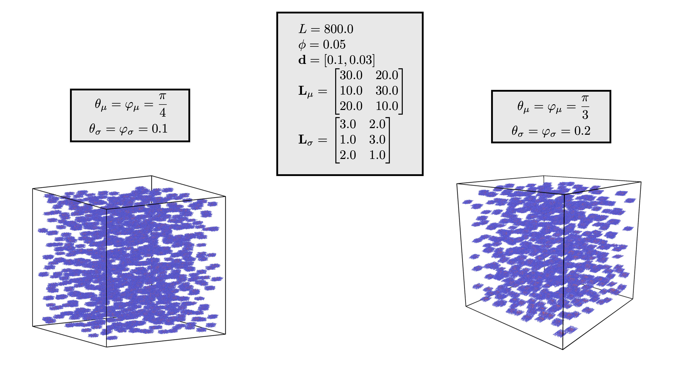

A box with parallelepipeds
=============================

See :ref:`parral` first

Structural features
--------------------
1. :math:`L` is the length of the box which contains the parallelepipeds

2. :math:`\phi` is the volume fraction of the object, :math:`\phi = \frac{\sum_i V_{i}}{L^3}`

3. :math:`\mathbf{d}` is the density of the shells of the parallelepipeds.

4. :math:`\mathbf{L}_\mu` is a matrix of the mean length difference between each shell. It
   has a shape of :math:`3 \times N`, with each row representing the three axes. Each column :math:`i`
   represents the length difference of the :math:`i\text{th}` shell of the parallelepiped.

5. :math:`\mathbf{L}_\sigma` is a matrix of the standard deviation of the :math:`\mathbf{L}_\mu` of
   shape :math:`3 \times N`.

6. :math:`\theta_\mu` and :math:`\varphi_\mu` are the mean slant angle of the :math:`xz` and :math:`yz` 
   plane respectively.

7. :math:`\theta_\sigma` and :math:`\varphi_\sigma` are the standard deviatoin of the 
   slant angle of :math:`\theta_\mu` and :math:`\varphi_\mu` respectively.

Example
-----------

  
  A box with parallelepipeds with varying slant angles

The distribution of lengths
----------------------------

Similar to the :ref:`box-onion` we must generate a log normal distribution of lengths.
The process is the same, with the matrix :math:`\mathbf{L}_\mu` and :math:`\mathbf{L}_\sigma`
being used instead of :math:`\mathbf{T}_\mu` and :math:`\mathbf{T}_\sigma`. Note that the
calculation of the volume for a parallelepiped is :math:`abc \sin \theta \sin \varphi` for 
lengths :math:`a`, :math:`b`, :math:`c`.

We obtain a vector of angles :math:`\boldsymbol{\theta}` and :math:`\boldsymbol{\varphi}` based on a log normal 
distribution. Then, we apply a restriction such that every angle is between :math:`0` and :math:`\frac{\pi}{2}`. 
Essential, any angle :math:`\alpha = \max \left(0, \min\left(\alpha, \frac{\pi}{2}\right)\right)`.

Generation of centers
----------------------

Once again, we use a similar process to :ref:`box-onion`, except with a difference in the overlap calculation.

The minimum distance between any two centers must be :

.. math::
  d_{ij} = \sqrt{\left(\frac{a_i}{2}\right)^2 + \left(\frac{b_i}{2}\right)^2 + \left(\frac{c_i}{2}\right)^2} + \sqrt{\left(\frac{a_j}{2}\right)^2 + \left(\frac{b_j}{2}\right)^2 + \left(\frac{c_j}{2}\right)^2}\\

Finally, at each center we generate a :ref:`parallelepiped <parral>`.
