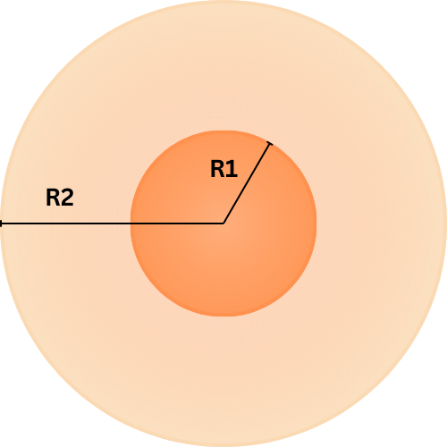
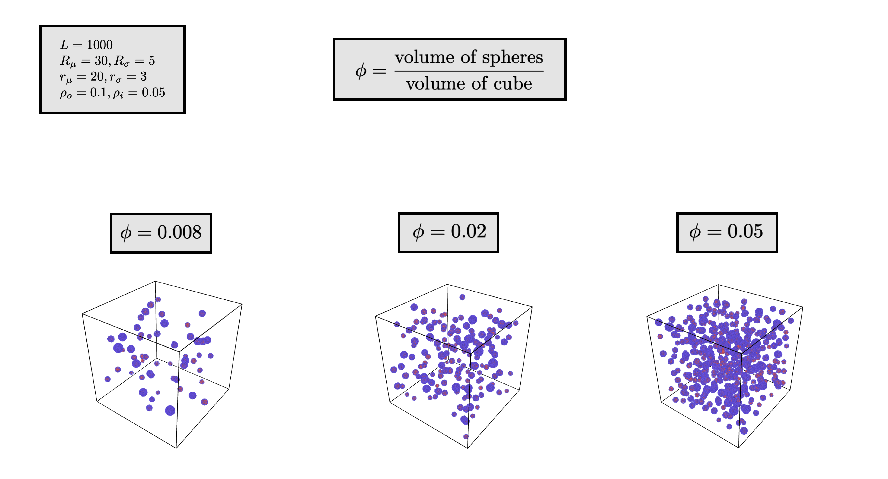

.. _box-spheres:

Box with uniform two-shell spheres
===============================================

Note that we generate each outer and inner radius on a log-normal distribution.

Structural features
---------------------
1. :math:`L` represents the length of the box.
2. :math:`R_{\mu}` represents the mean outer radius.
3. :math:`R_{\sigma}` represents the outer radius standard deviation.
4. :math:`r_{\mu}` represents the mean inner radius.
5. :math:`r_{\sigma}` represents the inner radius standard deviation.
6. :math:`\phi` represents the volume fraction. It is dimensionless. :math:`\phi = \frac{\sum V_{i}}{L^3}`, :math:`V_i` is the volume of sphere :math:`i`.
7. :math:`\rho_{o}` represents the outer shell's density of scatters in scatters (points) per unit volume.
8. :math:`\rho_i` represents the inner shell's density of scatters in scatters (point) per unit volume.

Schematic
------------

   The design of a two-shell sphere

Converting the shell to thickness
----------------------------------

When generating the log-normal distribution, there are cases where the outer radius :math:`R` is less than the inner radius :math:`r`.

One fix is to change the :math:`R_{\mu}` and :math:`R_{\sigma}` to a corresponding thickeness mean and standard deviation 
:math:`T_\mu` and :math:`T_\sigma`, respectively. To accurately represent the thickness, 
let

.. math::
  T_\mu = R_\mu - r_\mu 

  T_\sigma = \sqrt{R_\sigma ^ 2 - r_\sigma ^ 2}

The distribution of radii
--------------------------

First, create the new standard deviation's for use within the log-normal distribution.
This differs from the given standard deviations

.. math::
  \sigma_T = \sqrt{\ln \left(1 + \frac{T_\sigma ^ 2}{T_\mu ^ 2} \right)} 

  \sigma_r = \sqrt{\ln \left(1 + \frac{r_\sigma ^ 2}{r_\mu ^ 2} \right)} 

Then, create the new mean, 

.. math::
  \mu_T = \ln(T_\mu) - \frac{\sigma_T^2}{2}

  \mu_r = \ln(r_\mu) - \frac{\sigma_r^2}{2}

For more information, see the sidebar on `Wikipedia <https://en.wikipedia.org/wiki/Log-normal_distribution>`_

Next, we will create the outer radii array :math:`\mathbf{R}` and the inner radii :math:`\mathbf{r}`.

We systematically choose each outer and inner radii such that the total volume of the sphere (with radius being the outer shell)
doesn't exceed :math:`\phi L^3`.

**Step 1: Sampling the thickness and radii**

For each iteration, choose the thickness :math:`T` and the inner radius :math:`r`, as well as the outer radius :math:`R` such that:

.. math::
  T \sim \text{Lognormal}(\mu_T,\sigma_T)

  r \sim \text{Lognormal}(\mu_r, \sigma_r)

  R = T + r

**Step 2: Termination with volume fraction**

After each iteration, calculate the current volume :math:`V = \frac{4}{3} \pi R^3`
The total volume :math:`V_{tot}` is updated as well:

.. math::
  V_{tot} \leftarrow V_{tot} + V

This process continues until :math:`V_{tot} > \phi L^3`.

**Step 3: Storing the radii**

The sequences of the outer and inner radii are stored as vectors (represented as 1D arrays in code):

.. math::
   \mathbf{r} = [r_0, r_1, \dots, r_N]
   
   \mathbf{R} = [R_0, R_1, \dots, R_N]

Generating the centers
-------------------------

In order to avoid potential peaks in scattering, we use a brute force method to generate the centers.

Let the centers be :math:`\mathbf{C}`, a matrix of shape :math:`(N, 3)` representing each scatter in :math:`\mathbb{R}^3`.
Let the maximum outer radius of all the two-shell spheres be :math:`R_{max} = \max(\mathbf{R})`. This is to avoid overlapping.

Generate any point :math:`\mathbf{v} = (x, y, z)` by generating it uniformly over :math:`[-\frac{L}{2} + R_{max}, \frac{L}{2} - R_{max}]`.
The left and right bounds are adjusted so that the two-shell sphere doesn't generate outside of the bounding box of length :math:`L`.
:math:`\mathbf{v}` must have the property that it is at least a distance :math:`2 R_{max}` from other points. That is, for every 
:math:`\mathbf{p} \in \mathbf{C}`, :math:`\Vert \mathbf{v} - \mathbf{p} \Vert > 2 R_{max}`

Generating each sphere
-----------------------
For every center :math:`\mathbf{c}_j \in \mathbf{C}` generate a :ref:`uniform onion <uni-onion>` :math:`\mathbf{O}`
with thicknesses :math:`\mathbf{T} = [r_j, R_j - r_j]` and densities 
:math:`\mathbf{d} = [\rho_i, \rho_o]`. Then, add each point :math:`\mathbf{O} + \mathbf{c}` 
(essentially displacing the points from the origin to the center)
to the final structure :math:`\mathbf{S}`.

Examples
----------
**The volume fraction:** :math:`\phi`

  
  A box with spheres with varying volume fractions

The range of volume fractions showcase how the number of particles depends on :math:`\phi`. 
We take some features as constants:

.. math::
  L = 1000\\
  R_\mu = 30\\
  R_\sigma = 5\\
  r_\mu = 20\\
  r_\sigma = 3\\
  \rho_o  = 0.1\\
  \rho_i = 0.05
