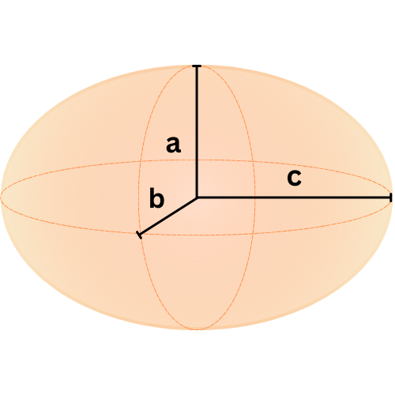
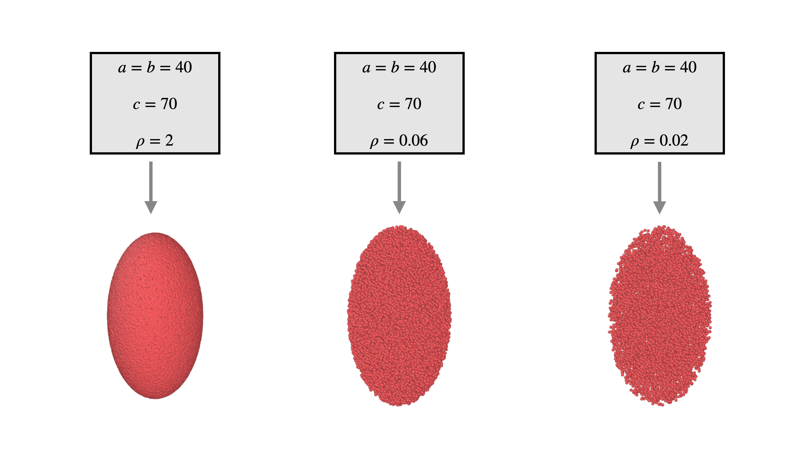

Uniform ellipsoid
===================

Structural features
--------------------
1. :math:`a`, :math:`b`, :math:`c` each represent the radius of the ellipsoid on the :math:`x`, :math:`y`, and :math:`z` axis respectively.
2. :math:`\rho` represents the density of scatters in scatters (points) per unit volume.

Schematic
-------------------

   
   The official design of the uniform ellipsoid

Ellipsoid Generation
------------------------------------
Instead of a uniform box, similar to the :ref:`sphere method <uni-sphere>`,
we use a cuboid of length :math:`a`, width :math:`b`, and height :math:`c`.

Create a uniform distribution :math:`U_{c}` with :math:`N = \lfloor \rho V_{c} \rfloor = \lfloor a\cdot b\cdot c\cdot \rho \rfloor` points.
The points are created such that they are bounded by the cuboid :math:`\left[ -a, a \right] \times \left[ -b, b \right] \times \left[ -c, c \right]`.
This is the bounding box surrounding the future ellipsoid.

Then, let the ellipsoid :math:`U = \left\{(x, y, z) \in U_c \mid \frac{x^2}{a^2} + \frac{y^2}{b^2} + \frac{z^2}{c^2} \le 1 \right\}`.
Essentially, we reject any points in the box that are outside the ellipsoid region.

Example
----------

  Three examples of the uniform ellipsoid object, each with different densities

The left image is very dense, due to a high :math:`\rho`, while the right image contains loosely scattered points.

This structure is generated using :ref:`the Ellipsoid class <ellipsoid-class>`

