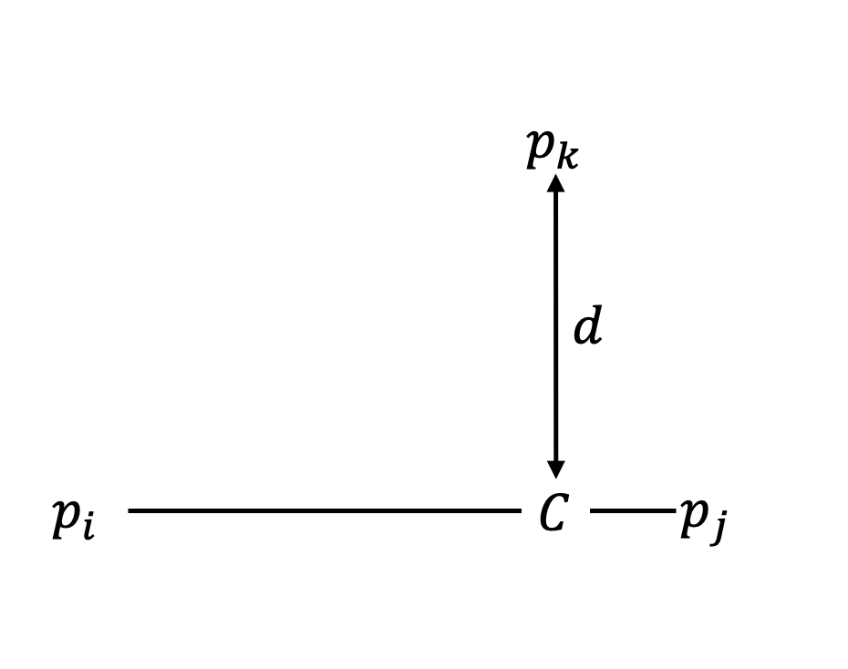
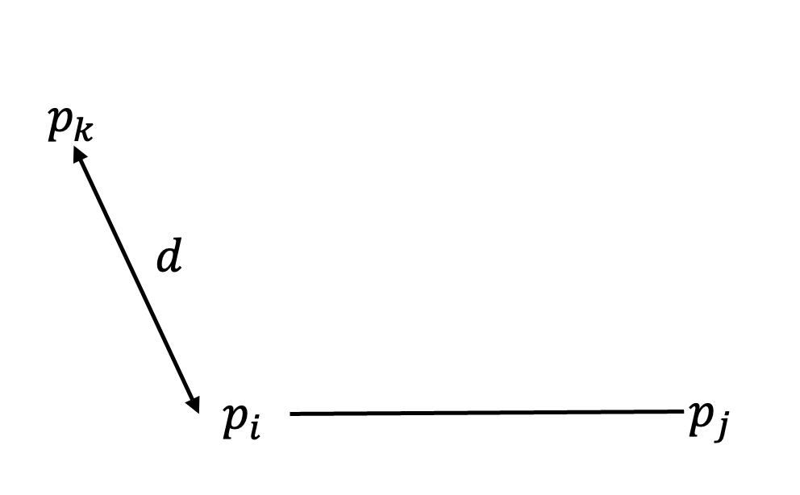
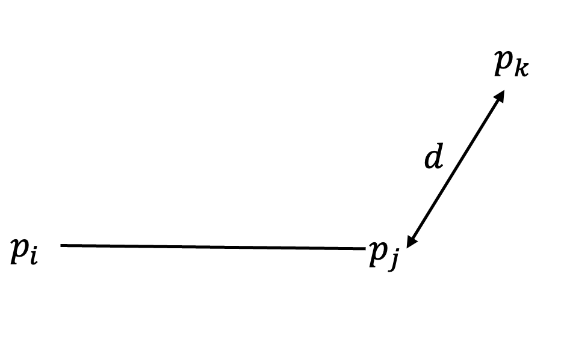

# A "network""-like structure

The structure consists of a system of spheres (nodes) which are
attached to each other via cylinders (branches).

## 0. Model definition

### Structural features

1. $\mu_r$: Mean radius of each node
2. $\sigma_r$: Standard deviation of each node
3. $N$: Number of nodes
4. $L_\text{box}$: The total length of the bounding box (encapsulating cube)
5. $\mu_{l}$: Mean branch length
6. $\sigma_{l}$: The standard deviation of the length of each branch
7. $M$: Number of branches per node
8. $R_c$ is the radius of each branch/cylinder
9. $\rho$ is the density of the scatters in points per unit volume

## 1. The components of the system

The core system is extremely similar to the graph data structure.

### Component 1: Nodes

The vertices of the graph, a.k.a the core components. Let this set of vertices be
$\mathbf{V} = (v_0, v_1, \dots, v_{N-1})$. Each vertex is a sphere in $\mathbb{R}^3$ with
center $p_i = (x_i, y_i, z_i)$ and radius $r_i$, whose creation will
be discussed further down.

### Component 2: Branches

These are the edges of the graph, $\mathbf{E}$, with each edge $e_k = (v_i, v_j)$
connects two nodes. Branch $k$ has a desired length of $l_k$. Let there be $B$ branches
total, which is derived from $N$ and $M$.

### Generating the lengths and radii

The lengths (branches) and radii (nodes) are formed by a log-normal distribution
with values $\mu_l$, $\sigma_l$ and $\mu_r$, $\sigma_r$ respectively. For more
information on this, see previous pages ("distribution of x").

### Optimization/Simulation parameters

* $I$: The number of iterations of the simulation.
* $S_\text{repel}$: The repulsion strength multiplier of each node.
* $k_{lr}$: The "learning rate" of the simulation. If its lower, its more precise
but requires more iterations.

## 2. The Goal

The goal is to form a system of nodes and branches that do not overlap and have desired
length and key features. Thus, we seek to minimize an energy function $U_{\text{sys}}$,
aiming for an equilibrium state.

$$ U_\text{sys} = U_\text{spring} + U_\text{repel} $$

### Spring potential energy: $U_\text{spring}$

The Spring potential energy is modeled by Hooke's Law, and sums over all branches.
The key here is to imagine each branch as a spring, with its relaxed length
being $l_k$. Until the very end of the simulation, these branches don't exist,
instead they are modeled between the two node components, as discussed,
forming $e_k$. The formal definition is as follows:

$$ U_\text{spring} = \sum \frac{1}{2} k_{lr} \left(\Vert p_j - p_i \Vert - l_k\right)^2$$

Which sums over all edges $e_k = (v_i, v_j)$

### Repulsion energy: $U_\text{repel}$

The repulsion energy tries to mitigate the chance of overlap between objects.
It does this by applying a force to objects that are intersecting, proportional
to the overlap amount.

First, define a function $f(d, d_\text{min})$ which calculates the repulsion force
from the distance between objects, and the minimum allowed.

$$ f(d, d_\text{min}) = \frac{1}{2}k_{lr} S_\text{repel} (|d - d_\text{min}|)^2 $$

$f$ grows rapidly as $d \to 0$.

$U_\text{repel}$ itself is formed of three main
components.

$$ U_\text{repel} = U_{nn} + U_{nb} + U_{bb} $$

* Node-Node repulsion: $U_{nn} = \sum f(d(p_i, p_j), r_i + r_j)$
* Node-Branch repulsion: $U_{nb} = \sum f(d(p_i, e_k), r_i + R_c)$
* Branch-Branch repulsion $U_{bb} = \sum f(d(e_k, e_i), 2R_c)$

The distance function $d(a, b)$ will be discussed [here](#repulsion-force-calculation)

## 3. Preliminary

Before we start the simulation, there are a few components that must be set up.

### The Graph's Generation

A graph data structure is used to represent which nodes connect to each other. We maintain the fact that, on average, each node has $M$ branches. Doing this naively,
by randomly adding branches until the degree $M$ is satisfied, usually results in
disconnected graphs or graphs with irregular degree $M$.

1. **Guarantee the graph is connected.** The simplest and most robust way to do this
is through a Hamiltonian cycle.
2. **Add randomness to satisfy the degree.** After, randomly add more edges until
we reach the target degree $M$.

#### Graph Input Validation

The most crucial part is making sure $N$ and $M$ are valid

  ```python
  if N * M % 2 != 0:
    # error
  if M >= N:
    # error
  ```

* $NM \bmod 2 = 0$: The amount of "stubs" (places where connections) form is $NM$.
Since each branch connects two of these stubs, it must be even.
* $M < N$. The number of connections, must be less than the total number of nodes.

#### Graph Initialization

```python
adj_list = {i: [] for i in range(N)}
degrees = {i: 0 for i in range(N)}
```

The graph is represented as an adjacency list. Represented in code as a dictionary,
it is a function $f: A \to \mathbf{B}$ where $f$ receives a node $i$ and
returns a list/vector of its connections.

#### Hamiltonian Cycle

```python
for i in range(N):
    neighbor = (i + 1) % N
    if neighbor not in adj_list[i]:
        adj_list[i].append(neighbor)
        adj_list[neighbor].append(i)
        degrees[i] += 1
        degrees[neighbor] += 1
```

This sets up a ring-like structure:

* Node $0$ connects to $1$
* Node $1$ connects to $2$
* $\dots$
* Node $N-1$ connects to Node $0$

Every node has a degree of $2$ at this point.

#### Add random branches/edges to graph

Now we try to bring the degree up to $M$

```python
potential_edges = []
for i in range(N):
    for j in range(i + 1, N):
        if j not in adj_list[i]:
            potential_edges.append((i, j))
```

This iterates through every possible pair of nodes $(i, j)$, and if they aren't
connected it adds them to a vector (in the code, called `potential_edges`)

```python
np.random.shuffle(potential_edges)
```

All this does it randomly shuffle all potential edges $(i, j)$

```python
for node1, node2 in potential_edges:
    if degrees[node1] < M and degrees[node2] < M:
        adj_list[node1].append(node2)
        adj_list[node2].append(node1)
        degrees[node1] += 1
        degrees[node2] += 1
```

For each edge, it checks if both nodes are below the target degree of $M$, and
if so creates a new connection between those nodes.

Finally, the resulting adjacency list is the representation of the graph.

### Representing Branches

Like mentioned before, the branches themselves don't exist in 3d space until
the very end. They are created as so:

```python
branches: list[tuple[int, int]] = []
visited_edges: set[tuple[int, int]] = set()
for node1 in range(NODE_AMOUNT):
    for node2 in graph.get(node1, []):
        edge: tuple[int, int] = (node1, node2) if node1 <= node2 else (node2, node1)
        if edge not in visited_edges:
            branches.append(edge)
            visited_edges.add(edge)
BRANCH_AMOUNT = len(branches)
```

All this does is form the edges $\mathbf{E}$, where each edge $e_k = (v_i, v_j)$
where $v_i \le v_j$

## 4. The Iterative Method

Now we start the simulation (the good part).

The first node is initially centered at $p_0 = (0, 0, 0)$ for consistency.
For the remaining $N-1$ nodes, their initial positions are generated in
a uniform distribution close to the origin.

Thus, we use a random
distribution with range close to the origin, such as $[-20, 20)$ for
each $(x_i, y_i, z_i), i \ne 0$.

We execute the force calculations $I$ times (the iterations).

The force on each node is the negative gradient of of the potential energy
function: $F_i = -\nabla_i U_\text{sys}$

### Spring Force Calculation

For each of the nodes $v_i, v_j$ that are in branch $e_k$, we apply
a force along the branch, as if it is a spring.

```python
vec = positions[node2] - positions[node1]
dist = np.linalg.norm(vec)

if dist < 1e-6:
  dist = 1e-6
  vec = np.random.rand(3) * 1e-6
```

First, we calculate the vector $\mathbf{u} = \mathbf{p}_j - \mathbf{p}_i$, with

$d = \Vert \mathbf{u} \Vert$
If $d$ is numerically very close to $0$, $d < 10^{-6}$, then
we set $d = 10^{-6}$ and randomize the direction of $\mathbf{u}$ such that
its magnitude is $10^{-6}$.

Thus, the force exerted along the branch will be

$$ F_\text{k, s} = k_{lr} (d - l_k) \hat{\mathbf{u}} $$

Thus, we offset node $i$ and node $j$ such that the total force is $F_\text{k, s}$.
That is, $F_\text{i, s} = \frac{F_\text{k, s}}{2}$.
And $F_\text{j, s} = -\frac{F_\text{k, s}}{2}$

### Repulsion Force Calculation

The spring forces pull the network together until reaching the target length,
but without repulsion, the structure would have many
intersections of objects, and it may collapse.
The repulsion forces are responsible for giving the network its volume
and ensures no two objects physically overlap.
They act as a strong "push" that activates only upon collision.

We calculate these forces throughout three different stages, which range from the
simplest to the most complex calculations. In each one, we iterate through all
the pairs of objects, check for an overlap, and if so we calculate and apply the
repulsion force.

The magnitude of the repulsion force is proportional to the depth or size of the
overlap.
For any two objects $A$ and $B$,
let their current distance be $d$ and their minimum allowed distance be $d_\text{min}$

* **Depth:** $\delta = d_\text{min} - d$
* **Repulsion Force Magnitude:**
$||\mathbf{F}_\text{repel}|| = k_{lr} S_\text{repel} \delta$

#### Stage 1: Node-Node Repulsion ($F_{nn}$)

This is the simplest repulsion, preventing the spherical nodes from intersecting
and passing through each other.

* **The Goal:** For any two nodes $v_i$ and $v_j$, the distance between their centers
$\mathbf{p}_i$ and $\mathbf{p}_j$ is greater than the sum of their radii, $r_i + r_j$.

* **Implementation:** We iterate through every unique pair of nodes $(v_i, v_j)$.

    ```text
    p_i   <-- d -->   p_j
    r_i---         ---r_j

    Collision if d < (r_i + r_j)
    ```

* **Calculation:**

    1. Minimum allowed distance: $d_\text{min} = r_i + r_j$.
    2. Similar to before, we calculate the vector between the node
    centers $\mathbf{u} = \mathbf{p}_j - \mathbf{p}_i$
    and its magnitude, the current distance $d = ||\mathbf{u}||$.
    3. **Check for Collision:** If $d < d_\text{min}$, an overlap exists.
    4. Calculate the overlap depth: $\delta = d_\text{min} - d$.
    5. The repulsion force vector $\mathbf{F}_\text{repel}$ has magnitude proportional to $\delta$ and acts along the
    direction vector $\hat{\mathbf{u}} = \mathbf{u}/d$, pushing the nodes apart.

        $$ \mathbf{F}_\text{repel} = k_{lr} S_\text{repel} \delta \cdot \hat{\mathbf{u}} $$
    6. This force is applied equally and oppositely to the two nodes, offsetting it:
        * Force on $v_i$: $\mathbf{F}_i = -\mathbf{F}_\text{repel} / 2$
        * Force on $v_j$: $\mathbf{F}_j = +\mathbf{F}_\text{repel} / 2$

#### Stage 2: Node-Branch Repulsion ($F_{nb}$)

This repulsion accounts for nodes intersecting with other branches.

* **The Goal**: For any node $v_k$ and branch $e_m = (v_i, v_j)$ where 
$k \ne i$ and $k \ne j$, the shortest distance between $p_k$ and
the line segment representing $e_m$ is greater than $r_k + R_c$
must satisfy $d < r_i + R_c$.
* **Implementation**: We need to find the closet point $\mathbf{C}$ on the line segment
$p_i p_j$ to the point $p_k$. There are three cases.
  1. $\mathbf{C}$ lies between $p_i$ and $p_j$\
    
  2. $\mathbf{C}$ is the left endpoint\
    

  3. $\mathbf{C}$ is the right endpoint\
    

* **Method**: We need to use a vector projection. We determine where a perpendicular 
projection of $\mathbf{P}$ lands relative to the segment connecting $\mathbf{A}$
and $\mathbf{B}$. This will be used in the calculation.

  First, we define vectors $\mathbf{u} = \mathbf{A} - \mathbf{B}$ (the segement's vector) and $\mathbf{v} = \mathbf{P} - \mathbf{A}$.

  Next, we must calculate the scalar projection parameter $t$

    $$ t = \frac{\mathbf{v} \cdot \mathbf{u}}{\mathbf{u} \cdot \mathbf{u}}  =
    \frac{(\mathbf{P} - \mathbf{A}) \cdot (\mathbf{B} - \mathbf{A})}{\Vert \mathbf{B} - \mathbf{A} \Vert ^2} $$
  Using the definition of a dot product and geometry, this reduces to 
  $t = \frac{\Vert AC \Vert}{\Vert u \Vert}$. 

  If $t \le 0$, $\mathbf{C} = \mathbf{A}$. 
  If $t \ge 1$, $\mathbf{C} = \mathbf{B}$. If $0 < t < 1$, 
    $\mathbf{C} = \mathbf{A} + t \cdot \mathbf{u}$. 

  The final distance is $d = \Vert \mathbf{P} - \mathbf{C} \Vert$
* **Calculation**
  1. The minimum allowed distance $d_\text{min} = r_k + R_c$
  2. For node $v_k$ and branch $e_m = (v_i, v_j)$ use the method above 
  with $\mathbf{P} = p_k$, $\mathbf{A} = p_i$, $\mathbf{B} = p_j$ to find 
  the distance $d$ and the closet point $C$.
  3. If $d < d_\text{min}$ then let the overlap region be $\delta = d_\text{min} - d$.
  4. The repulsion force acts along the direction from $\mathbf{C}$ to $p_k$.

  $$ \mathbf{F}_\text{repel} = k_\text{lr} S_\text{repel} \delta \frac{p_k - \mathbf{C}}{\Vert p_k - \mathbf{C} \Vert} $$
  5. This force is distributed to three nodes.

  $$F_k = + \mathbf{F}_\text{repel} \\
    F_i = -(1 - t) \mathbf{F}_\text{repel} \\
    F_j = -t\mathbf{F}_\text{repel}$$

#### Stage 3: Branch-Branch Repulsion

* **The Goal**:  For any two line segments $e_k = (v_i, v_j)$ and $e_l = (v_a, v_b)$,
the shortest distance between their line segments is greater than $2 R_c$

* **Method**: We must find the shortest distance between two line segments, $S_1$
  from $\mathbf{P}_1$ to $\mathbf{Q}_1$, and $S_2$ from $\mathbf{P}_2$ to $\mathbf{Q}_1$.
  
  First, lets define the segments parametrically.

  $$ L_1 (s) = \mathbf{P}_1 + s \cdot \mathbf{u}, \quad \mathbf{u} = \mathbf{Q}_1 - \mathbf{P}_1 \\
     L_2(t) = \mathbf{P}_2 + t \cdot \mathbf{v}, \quad \mathbf{v} = \mathbf{Q}_2 - \mathbf{P}_2$$

  The squared distance between any two points on the line is $D(s, t)^2 = \Vert L_1(s) - L_2 (t) \Vert ^2$.

  To find the minimum distance, we solve the system of equations: $\frac{\partial D^2}{\partial t} = 0$ and 
  $\frac{\partial D^2}{\partial s} = 0$

  INCOMPLETE, PROCEDE
  <!-- TODO: COMPLETE SECTION-->

* **Calculation** 
  1. The minimum distance is $d_\text{min} = 2 R_c$
  2. For two non-adjacent (doesn't connect to the same node) branches $e_k = (v_i, v_j)$ and
  $e_l = (v_a, v_b)$, use the method above to find the shortest distance $d$ and the points at
  which it occurs $\mathbf{C}_k$ on $e_k$, $\mathbf{C}_l$ on $e_l$. 
  3. If $d < d_\text{min}$, then define $\delta = d_\text{min} - d$. 
  4. The repulsion force acts upon the line which represents the distance, thus:
  
  $$ F_\text{repel} = k_{lr} S_\text{repel} \delta \cdot \frac{\mathbf{C}_k - \mathbf{C}_l}{\Vert \mathbf{C}_k - \mathbf{C}_l \Vert} $$
  5. We now distribute the forces.
  The force on branch $e_k$ is $+\frac{F_\text{repel}}{2}$. This is distributed to $v_i$ and $v_j$ based on $s$ similar to the Node-Branch
  stage. The force on branch $e_l$ is $-\frac{F_\text{repel}}{2}$ which is distributed to $v_a$ and $v_b$ similar to before witht he $t$ parametric position.


