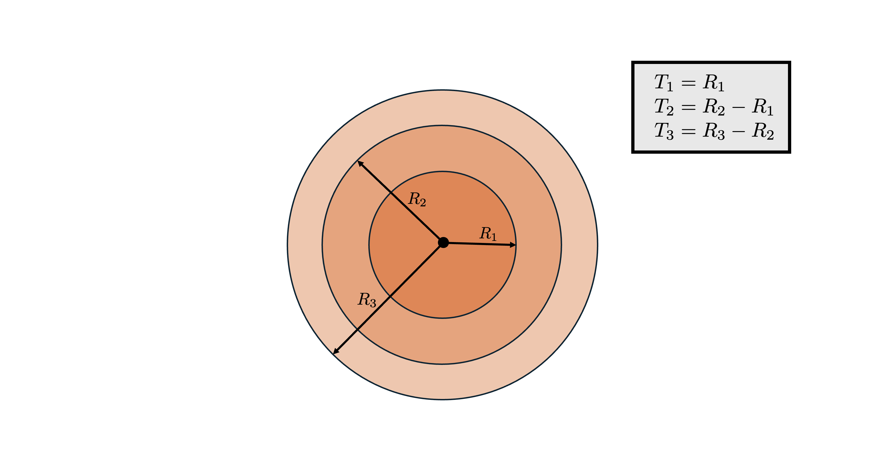
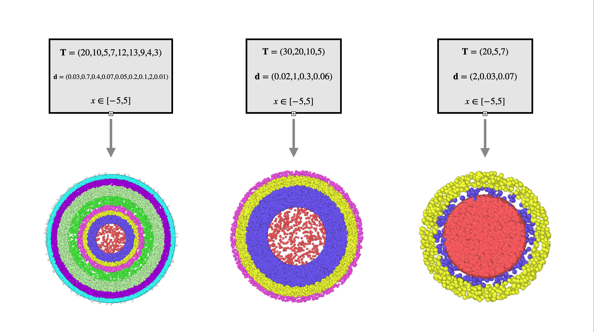

.. _uni-onion:

An onion
===============

This structure is generated using :ref:`the Onion class <onion-class>`

Structural features
----------------------
1. :math:`\mathbf{T}` is an vector which contains the thickness 
   (:math:`r_\text{outer}- r_\text{inner}`) of each shell, starting from the core. 
   The core's thickness is its radius (see schematic below). 
2. :math:`\mathbf{d}` is an vector which contains each shell's density of scatters. 
   Each density is represented in scatters (points) per unit volume.

Schematic (Cross section)
------------------------------

   
   The design of a uniform onion's cross section

Generation
------------

We use a similar :ref:`method<uni-sphere>` employed with the uniform sphere, but rather for each shell.

For each :math:`t_i \in \mathbf{T}`, the inner radius is :math:`r_{\text{inner}, i} = \sum_{n=0}^{i} t_n` (the sum of all previous thicknesses) 
while the outer radius is :math:`r_{\text{outer}, i} = r_{\text{inner}, i} + t_i`. The inner radius of the core is :math:`0`, which is why the thickness
is just the radius of the core.

Now, generate a uniform box :math:`U_{box, i}` inside the bounded box surrounding the current shell :math:`i`, :math:`[-r_{\text{outer}, i}, r_{\text{outer}, i}]^3`, 
with density :math:`d_i \in \mathbf{d}`. Similar to the :ref:`sphere <uni-sphere>`, :math:`N = t_i d_i`

Instead of keeping each point :math:`\mathbf{v} \in \mathbb{R}^3` inside :math:`U_{box, i}` with the :ref:`previous method <uni-sphere>`, 
only keep the points if each vector :math:`\mathbf{v}` satisfies :math:`r_{inner, i} \le \Vert \mathbf{v} \Vert \le r_{outer, i}`. 

Essentially, we are only keeping points within the given shell (outer and inner radius). This allows for multiple thicknesses and densities.

Example
----------

  Cross-section of three onions with a varying amount of thickness, densities, and shells

These images demonstrate how certain onions will look like based on their shell count. 
The cross section showcases their densities, which is similar to that of the :ref:`sphere <uni-sphere>`

