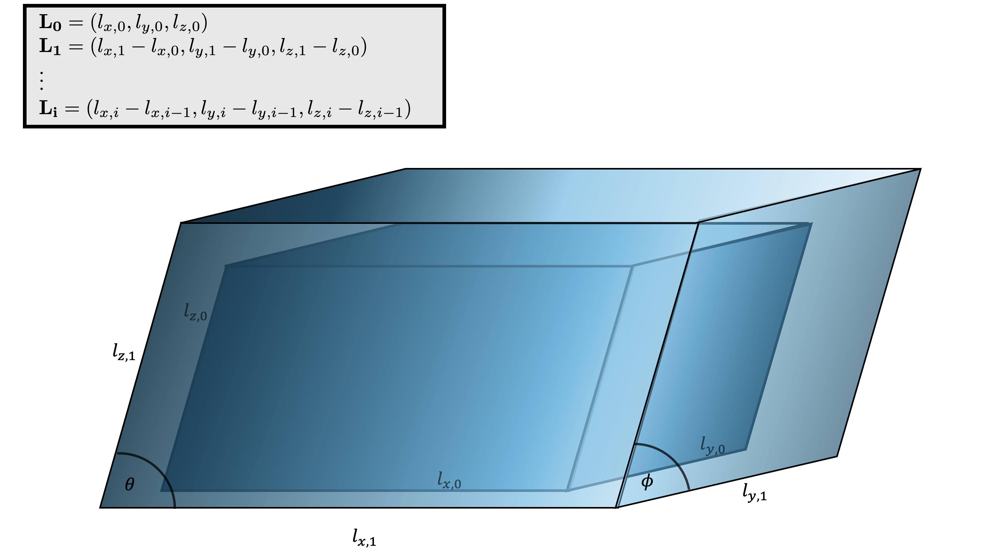
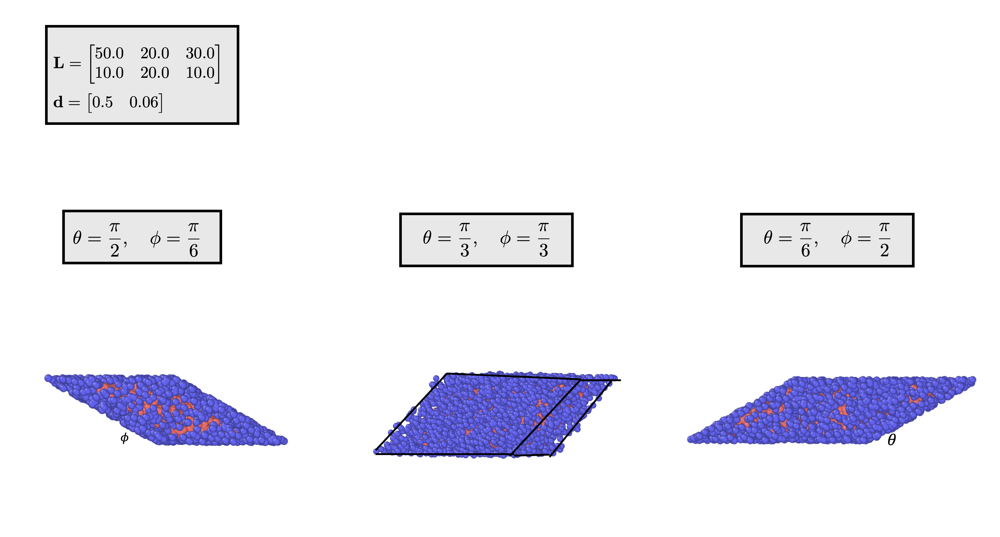

.. _parral:

Parallelepiped shells
=======================

Structural features
--------------------
1. We represent the length difference of each shell as an :math:`N\times3` 
   matrix :math:`\mathbf{L}`. Similar to the onion model, each component 
   :math:`(x, y, z)` is the amount the object *extends* in the plane, rather
   than the actual length.

2. The density :math:`\mathbf{d}` of the structure is represented in points per 
   unit volume.
3. :math:`\theta` represents the slant rotation in the :math:`xz` plane, 
   :math:`\theta \in \left(0, \frac{\pi}{2}\right]`. 

4. :math:`\varphi` is the slant rotation in the :math:`yz` plane.
   :math:`\varphi \in \left(0, \frac{\pi}{2}\right]`

5. :math:`\theta = \varphi = \frac{\pi}{2}` corresponds to a cuboid.

Schematic
----------

   The design of a two-shelled parallelepiped. 

Iterative nature
-----------------
The generation follows an iterative process, where we
generate each shell sequentially. The combination of all these points
forms the final structure.

Shell-by-shell process
-----------------------
For any shell :math:`i`, we first obtain the maximum distance in the :math:`x, y, z` 
planes, which is **not** the length.
We treat each length as a vector. The inner length vector is
:math:`\mathbf{l}_{\text{inner}} = \sum_{j=0}^{i-1} L_j`, and the outer length 
vector :math:`\mathbf{l}_{\text{outer}} = L_i + \mathbf{l}_{i, \text{inner}}`

For the :math:`x` distance, this is simply the dot product 
:math:`x_{l, \text{outer}} = l_{x, \text{outer}} l_{z, \text{outer}} \cos \theta`,
which is analogous to the :math:`y` distance  
:math:`y_{l, \text{outer}} = l_{y, \text{outer}} l_{z, \text{outer}} \cos \varphi`. 

The :math:`z` distance is affected by the slant angles, thus becoming 
:math:`z_{l, \text{outer}} = l_{z, \text{outer}} \sin \theta \sin \varphi`

Finally, we define the inner length's distance.

.. math::
   x_{l, \text{inner}} = l_{x, \text{inner}} l_{z, \text{inner}} \cos \theta\\
   y_{l, \text{inner}} = l_{y, \text{inner}} l_{z, \text{inner}} \cos \varphi\\
   z_{l, \text{inner}} = l_{z, \text{inner}} \sin \theta \sin \varphi

We use a rejection method, where we generate the points in the cuboid encapsulating
the parallelepiped, then only keep the points inside the parallelepiped's range.

We generate 
:math:`n = d_i V_{\text{cuboid}} = \rho(x_{\text{outer}}y_{\text{outer}}z_{\text{outer}})`
points in the uniform range. Recall that :math:`d_i` is the current density. Thus, we define:

.. math::
   \mathbf{U}_{x, \text{cuboid}} \sim \text{Uniform} \left(n, \frac{-x_{l, \text{outer}}}{2}, \frac{x_{l, \text{outer}}}{2}\right)\\
   \mathbf{U}_{y, \text{cuboid}} \sim \text{Uniform} \left(n, \frac{-y_{l, \text{outer}}}{2}, \frac{y_{l, \text{outer}}}{2}\right)\\
   \mathbf{U}_{z, \text{cuboid}} \sim \text{Uniform} \left(n, \frac{-z_{l, \text{outer}}}{2}, \frac{z_{l, \text{outer}}}{2}\right)

We apply the first restrictions to keep the points within the *outer* radius, which 
are as follows:

.. math::
   \mathbf{U}_1 = \left\{ (x, y, z) \in \mathbf{U}_\text{cuboid} \, \middle| \, \begin{array}{l}
    0 \le  x - \frac{z}{\tan \theta} \le x_{l, \text{outer}}\\
    0 \le  y - \frac{z}{\tan \varphi} \le y_{l, \text{outer}}\\
    |z| \le \frac{z_{l, \text{outer}}}{2}
    \end{array} \right\}

To apply the second restrictions to keep the points outside the *inner* thickness,
we apply similar restrictions, exchanging the outer lengths with the inner lengths. 
We instead **reject** any points that fall within
the inner range.

The resulting points will form the shell :math:`\mathbf{U}_{i}`

Example
-----------

  Cross sections and 3d images for a parallelepiped with changing slant angles. On the 
  left, there is a cross section of the :math:`yz`-plane showcasing :math:`\varphi`. The 
  center image shows a complete parallelepiped with the same :math:`\theta` and :math:`\varphi`.
  The right image shows a cross section of the :math:`xz` plane showcasing the :math:`\theta` angle.

This image demonstrates how parallelepiped objects respond to the slant angle, with cross sections 
being used. The image on the right is more slanted than the left, despite :math:`\varphi_\text{left} = \theta_\text{right}`,
because of the larger :math:`x` length. The density and lengths are constant throughout the example.

Code
-------
`Generate the parallelepiped shells <https://github.com/vaibhav-venkat/shapes_3d/blob/main/shapes_3d/objects/parallelepiped.py>`_
