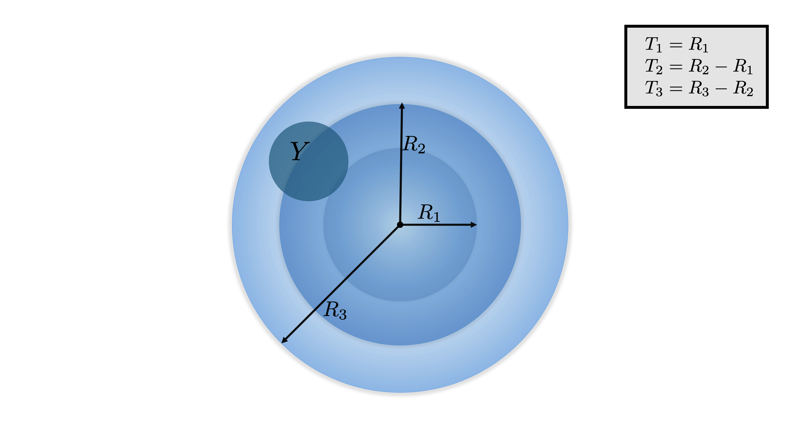
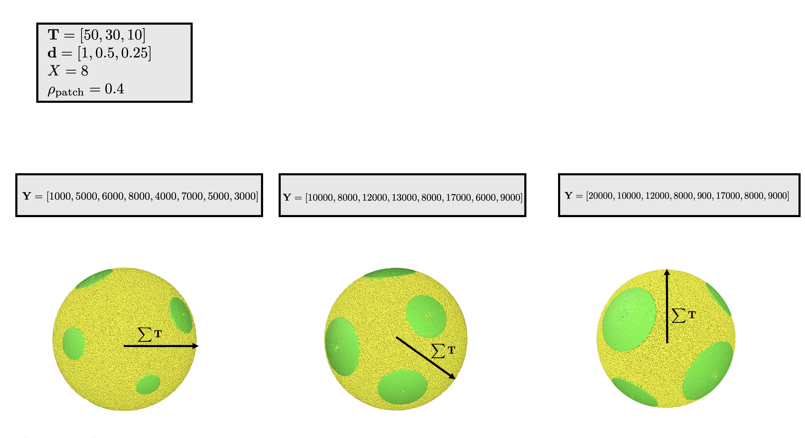

.. _patchy-onion:

An onion with patches
==============================

Structural features
--------------------
1. :math:`\mathbf{T}` is the thickness of each shell of the onion.
2. :math:`\mathbf{d}` is a vector representing the density of scatters in the shells, in scatters per unit volume.  
   :math:`d_i \in \mathbf{d}` is the density of the :math:`i`-th shell.
3. :math:`\mathbf{Y}` is a vector representing the area of the patches.
4. :math:`X` is the number of patches on the onion.
5. :math:`\rho_\text{patch}` is the density of scatters in a patch, in scatters per unit area.

Schematic
-----------

 
   The design of a patchy onion

Onion creation
----------------
The onion is created using the same instructions in the :ref:`uniform onion <uni-onion>`, with thickness :math:`\mathbf{T}` and density :math:`\mathbf{d}`.

Patch creation
-----------------
The patches are created using the same method we used in the :ref:`patchy sphere <patch-sphere-method>`, with the outer shell being the "sphere."
We use the radius :math:`R = \sum_{i} T_i`, area :math:`\mathbf{Y}`, patch number :math:`X`, and density :math:`\rho_\text{patch}`.

Examples
----------
We already explored examples for the :ref:`patchy sphere <patch-sphere-ex>`, where we saw the patch density.
We now have different patch sizes for each patch:

  
  A uniform onion with patches. All of the spheres have structural features :math:`\mathbf{T} = [50, 30, 10]`, :math:`\mathbf{d} = [1, 0.5, 0.25]`,
  :math:`X = 8`, :math:`\rho_{\text{patch}} = 0.4`. They have a varying patch size, with each patch having a unique patch size.

Code
-----------
`Generate a cube with onions <https://github.com/vaibhav-venkat/shapes_3d/blob/main/shapes_3d/objects/patchy_onion.py>`_
