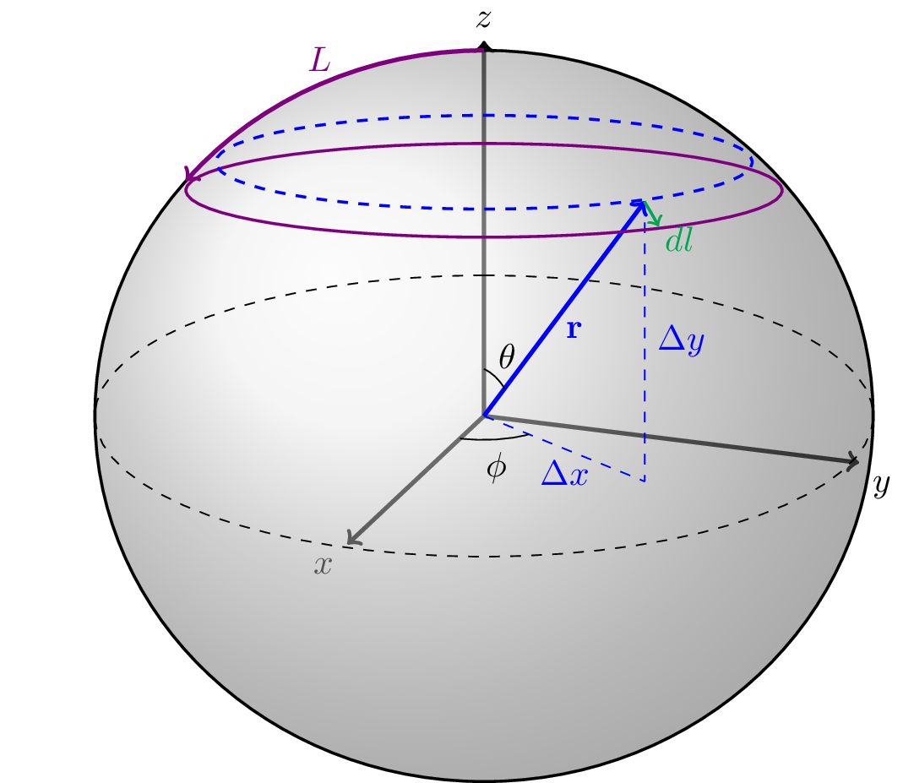
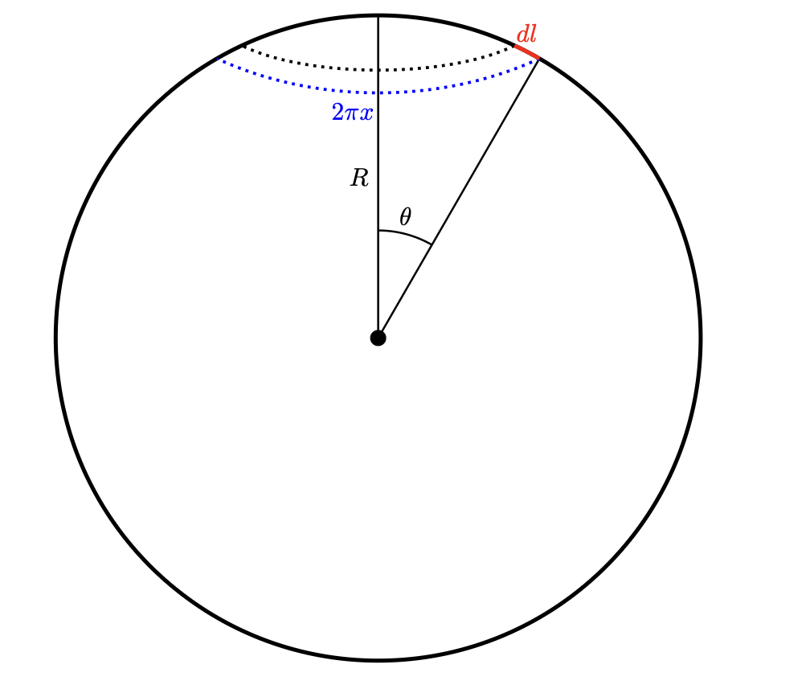

A uniform sphere with patches
===============================

Structural features
--------------------
1. :math:`R` is the radius of the sphere
2. :math:`\rho_\text{sphere}` is the density of scatters in the sphere, in scatters per unit volume.
3. :math:`\mathbf{Y}` is an vector representing the area of the patches. 
4. :math:`X` is the number of patches on the sphere
5. :math:`\rho_\text{patch}` is the density of scatters in the patch, in scatters per unit area.

Schematic
-----------

.. figure:: images/sphere_with_patch.png
   
   The design of a patchy sphere, with one patch labeled

There are two components to the structure, the sphere and the patches. The
sphere is made by simply using the method of the :ref:`uniform sphere <uni-sphere>`.

Step 1: Converting the area to radius
---------------------------------------------

In order to make a patch, we generate it with its radius. This is because
we need a specific arc length in order to generate the patch using code. The area on its own is
not informative.

Lets assume we have an radius :math:`L_i` and an area of :math:`Y_i`. 

First, we find the patch's position :math:`x` in the plane.

Lets decompose the patch so we can represent it in the plane. 
We can select the patch to be centered at the polar angle 
:math:`0` rad.

First, we know that :math:`x = R \sin \theta`, so lets find the polar angle :math:`\theta` of the patch's boundary (see Figure 1.). 
At any point :math:`l` within the radius :math:`L_i`:

.. math::
   R \theta = l \\
   \Rightarrow \theta = \frac{l}{R}\\
   \Rightarrow x = R \sin \left(\frac{l}{R} \right)

   Figure 1. The patch's radius in the plane is denoted as :math:`x`, its polar angle for its radius :math:`\theta`, and its radius :math:`l`. 

Next, take a small strip of the patch with a width of :math:`dl` (See figure 2). The area of the strip is :math:`2 \pi x dl`.
(circumfrence times width). Thus, the total area :math:`Y_i` of the patch is:

.. math::
   Y_i = \int_{0}^L 2 \pi R \sin \left(\frac{l}{R}\right) dl \\
   = 2 \pi R^2 \int_{0}^{L/R} \sin u du \quad (u = l/R) \\
   = - 2 \pi R^2 \cos u \Big|_0^{L/R} \\
   = 2 \pi R^2 (1 - \cos (L / R))

Thus

.. math::
  L_i = R \cos^{-1} \left(1 - \frac{Y_i}{2 \pi R^2}\right)

   Figure 2. A small strip of the patch with width :math:`dl`, and circumfrence :math:`2 \pi x`

Step 2: Generating a patch centered at the north pole
------------------------------------------------------

Next, in order to actually make the patches, we create a patch centered at the 
polar angle :math:`0`, and then we rotate it. We do the same process for each 
patch, so we omit the iteration symbol :math:`i` for brevity. 

We start at the North Pole because the scatters on a patch will distort if we start at the centers. 
This is because revolving the points around the z axis creates a much larger circle the closer we are to the equator,
and we defined our arc radius (above) with the north pole in mind.

We generate the patch by sampling the polar and azimuthal angles.
First, lets assume we have :math:`N_{polar}` samples for the polar angles.

Now, for each polar angle we sample :math:`N_{azi}` azimuthal angles.
Since :math:`N_{polar} \cdot N_{azi} \le N_{tot}` (the total scatters),

.. math::
  n_{\text{samples}} = N_{polar} = N_{azi} =  \left \lfloor \sqrt{N_{patch}} \right \rfloor = \left \lfloor \sqrt{Y_i \cdot \rho_\text{patch}} \right \rfloor
  
Note that this is an estimation.

Next, we generate :math:`n_{\text{samples}}` polar angles within the patch.  In order to avoid clustering and gaps within the patch, we use a 
quasi-random `Sobol sequence <https://en.wikipedia.org/wiki/Sobol_sequence>`_, sampling over the interval :math:`[0, 1)`. We
use a Sobol sequence because without it we see frequent gaps in the center of the patch, and also in the outer rings.
We generate a sequence :math:`\mathbf{v} = [v_1, v_2, \dots, v_{n_{\text{samples}}}]` where :math:`v_k \sim \text{Sobol}(0,1)`
for :math:`k = 1, 2, \dots, n_{\text{samples}}`

We convert these values into polar angles :math:`\boldsymbol{\theta} = [\theta_1, \theta_2, \dots, \theta_{n_{\text{samples}}}]`.
Given the final polar angle of the boundary :math:`\theta_{\text{fin}} = L / R` (where :math:`L` is the current patch's radius), we map
the values to polar angles using:

.. math::
  \theta_k = \cos^{-1} (1 - v_k (1 - \cos(\theta_{fin})))

This mapping ensures that any :math:`\theta_k` is within the interval :math:`[0, \theta_{fin})`.
:math:`\theta_k = 0` when :math:`v_k = 0`, 
and :math:`\theta_k \rightarrow  \theta_{fin}` when :math:`v_k \rightarrow 1`.

For the azimuthal angles, we generate a vecotr :math:`\boldsymbol{\phi} = [\phi_1, \phi_2, \dots, \phi_{n_{\text{samples}}}]` of
uniformly distributed values within the interval :math:`[0, 2 \pi)`. That is, :math:`\phi_j \sim \text{uniform}(0, 2\pi)` for
:math:`j = 1, 2, \dots, n_{\text{samples}}`.

Finally, for all pairs of polar angle :math:`\theta_k` and azimuthal angle :math:`\phi_j`, assign 
a scatter :math:`\mathbf{p_kj} \in \mathbb{R}^3`:

.. math::
   \mathbf{p}_{kj} =  \left[R \cos(\phi_{j}) \sin (\theta_k), 
   R \sin (\phi_{j}) \sin (\theta_k), 
   R \cos (\theta_k)\right]

Essentially, for each polar angle we are generating scatters with all the azimuthal angles.
Let the matrix :math:`\mathbf{P}` be the collection of all such scatters, having a shape of :math:`((n_{\text{samples}})^2, 3)`

Step 3: Finding the centers
---------------------------

