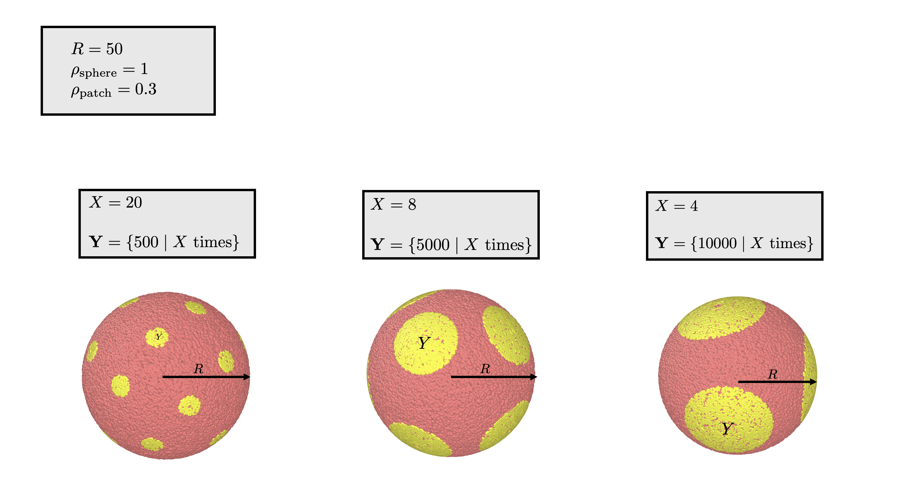
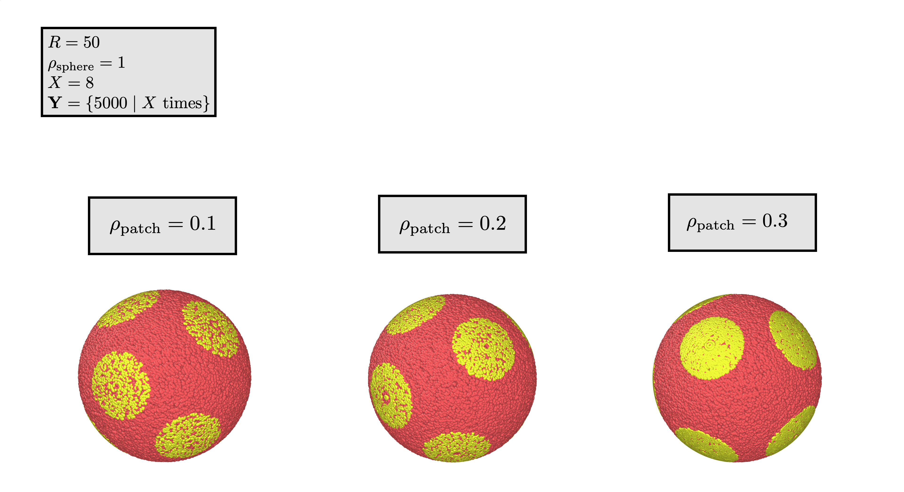

A sphere with patches
===============================

Structural features
--------------------
1. :math:`R` is the radius of the sphere
2. :math:`\rho_\text{sphere}` is the density of scatters in the sphere, in scatters per unit volume.
3. :math:`\mathbf{Y}` is a vector representing the area of the patches. 
4. :math:`X` is the number of patches on the sphere
5. :math:`\rho_\text{patch}` is the density of scatters in a patch, in scatters per unit area.

Schematic
-----------

.. figure:: images/sphere_with_patch.png
  :class: with-border

There are two components to the structure, the sphere and the patches. 

The sphere
-------------
The sphere is made by simply using the same instructions in :ref:`uniform sphere <uni-sphere>`
with radius :math:`R` and density :math:`\rho_\text{sphere}`.

.. _patch-sphere-method:

Creating the patches
----------------------
We create the patches using the series of steps below.

Step 1: Converting the area to radius
---------------------------------------------

In order to make a patch, we generate it with its radius. This is because
we need a specific arc length in order to generate the patch using code. The area on its own is
not informative.

Let's assume we have a radius :math:`L_i` and an area of :math:`Y_i`. 

First, we find the patch's position :math:`\Delta x` in the plane.

Let's decompose the patch so we can represent it in the plane. 
We can select the patch to be centered at the polar angle 
:math:`0` rad. The arc radius is irrespective of the azimuthal angle.

First, we know that :math:`\Delta x = R \sin \theta`, so let's find the polar angle :math:`\theta` of the patch's boundary (see Figure 1.). 
At any point :math:`l` within the radius :math:`L_i`:

.. math::
   R \theta = l \\
   \Rightarrow \theta = \frac{l}{R}\\
 
Thus

.. math::
  L_i = R \cos^{-1} \left(1 - \frac{Y_i}{2 \pi R^2}\right)

  \Rightarrow \Delta x = R \sin \left(\frac{l}{R} \right)

Next, take a small strip of the patch with a width of :math:`dl` (see Figure 1.) . The area of the strip is :math:`2 \pi \Delta x dl`.
(circumference times width). Thus, the total area :math:`Y_i` of the patch is:

.. math::
   Y_i = \int_{0}^L 2 \pi R \sin \left(\frac{l}{R}\right) dl \\
   = 2 \pi R^2 \int_{0}^{L/R} \sin u du \quad (u = l/R) \\
   = - 2 \pi R^2 \cos u \Big|_0^{L/R} \\
   = 2 \pi R^2 (1 - \cos (L / R))

.. figure:: images/patches/radius_length.png
   :width: 60%

   Figure 1. The patch's radius in the plane is denoted as :math:`\Delta x`, its polar angle for its radius :math:`\theta`, and its total radius :math:`L`. 

Step 2: Generating a patch centered at the north pole
------------------------------------------------------

Next, in order to actually make the patches, we create a patch centered at the 
polar angle :math:`0`, and then we rotate it. We do the same process for each 
patch, so we omit the iteration symbol :math:`i` for brevity. 

We start at the North Pole because the scatters on a patch will distort if we start at the centers. 
This is because revolving the points around the z axis creates a much larger circle the closer we are to the equator,
and we defined our arc radius (above) with the north pole in mind.

We generate the patch by sampling the polar and azimuthal angles.
First, lets assume we have :math:`N_{polar}` samples for the polar angles.

Now, for each polar angle we sample :math:`N_{azi}` azimuthal angles.
Since :math:`N_{polar} \cdot N_{azi} \le N_{tot}` (the total scatters),

.. math::
  n_{\text{samples}} = N_{polar} = N_{azi} =  \left \lfloor \sqrt{N_{patch}} \right \rfloor = \left \lfloor \sqrt{Y_i \cdot \rho_\text{patch}} \right \rfloor
  
Note that this is an estimation.

Next, we generate :math:`n_{\text{samples}}` polar angles within the patch.  In order to avoid clustering and gaps within the patch, we use a 
quasi-random `Sobol sequence <https://en.wikipedia.org/wiki/Sobol_sequence>`_, sampling over the interval :math:`[0, 1)`. We
use a Sobol sequence because without it we see frequent in the outer rings.
We generate a sequence :math:`\mathbf{v} = [v_1, v_2, \dots, v_{n_{\text{samples}}}]` where :math:`v_k \sim \text{Sobol}(0,1)`
for :math:`k = 1, 2, \dots, n_{\text{samples}}`

We convert these values into polar angles :math:`\boldsymbol{\theta} = [\theta_1, \theta_2, \dots, \theta_{n_{\text{samples}}}]`.
Given the final polar angle of the boundary :math:`\theta_{\text{fin}} = L / R` (where :math:`L` is the current patch's radius), we map
the values to polar angles using:

.. math::
  \theta_k = \cos^{-1} (1 - v_k (1 - \cos(\theta_{fin})))

This mapping ensures that any :math:`\theta_k` is within the interval :math:`[0, \theta_{fin})`.
:math:`\theta_k = 0` when :math:`v_k = 0`, 
and :math:`\theta_k \rightarrow  \theta_{fin}` when :math:`v_k \rightarrow 1`.

For the azimuthal angles, we generate a vector :math:`\boldsymbol{\phi} = [\phi_1, \phi_2, \dots, \phi_{n_{\text{samples}}}]` of
uniformly distributed values within the interval :math:`[0, 2 \pi)`. That is, :math:`\phi_j \sim \text{uniform}(0, 2\pi)` for
:math:`j = 1, 2, \dots, n_{\text{samples}}`.

Finally, for all pairs of polar angle :math:`\theta_k` and azimuthal angle :math:`\phi_j`, assign 
a scatter :math:`\mathbf{p_kj} \in \mathbb{R}^3`:

.. math::
   \mathbf{p}_{kj} =  \left[R \cos(\phi_{j}) \sin (\theta_k), 
   R \sin (\phi_{j}) \sin (\theta_k), 
   R \cos (\theta_k)\right]

Essentially, for each polar angle we are generating scatters with all the azimuthal angles.

Step 3: Finding the centers
---------------------------

Before rotating the patches, we need a coordinate that represents each patch's center. 
We will use spherical coordinates.

We will use the Fibonacci sphere method in order to make the patches as 
evenly spaced as we can. The Fibonacci method makes use of the golden ratio.

We first generate an "index" array, of which we base our polar and azimuthal centers on. 
It is a vector :math:`\mathbf{u}` with :math:`X` evenly spaced values, starting from :math:`0`. 
That is, :math:`\mathbf{u} = [0, 1, 2, \dots, X - 1]`.

The polar and azimuthal centers are defined by:

.. math::
   \boldsymbol{\theta} = \cos^{-1} \left(1 - \frac{2 \cdot \mathbf{u}}{X}\right) \\
   \boldsymbol{\phi} = \frac{2 \pi \cdot u}{\varphi} \qquad (\varphi = (1 + \sqrt{5})/2)

with :math:`\varphi` being the golden ratio

A patch :math:`i` has a center of :math:`(R, \theta_i, \phi_i)` for 
:math:`\theta_i \in \boldsymbol{\theta}` and :math:`\phi_i \in \boldsymbol{\phi}`.

We then randomly rotate each center using quaternions, as described in step 4. We
generate a random vector :math:`\mathbf{v}` with 4 components, each component :math:`v_i \in [-1, 1]`.
We apply one rotation to all the centers, so that the patches will still be evenly spaced.

Step 4: Rotate the patches
-----------------------------

Finally, we rotate a patch at the north pole to the given center.

For a patch :math:`i` we rotate a patch at the north pole to the center :math:`(R, \theta_i, \phi_i)`.

First, we rotate the patch about the :math:`y`-axis. We use `rotational quaternions <https://en.wikipedia.org/wiki/Quaternions_and_spatial_rotation>`_.
Quaternions are a precise way to define rotations. Our first rotational quaternion will 
rotate all points by the polar angle :math:`\theta_i` around the :math:`y`-axis, and the 
next quaternion will rotate the patch around the z-axis (after the first rotation) by
:math:`\phi_i` (azimuthal angle). The quaternions are:

.. math::
  \mathbf{q}_{i,1} = \left(\cos\frac{\theta_i}{2}, 0, \sin\frac{\theta_i}{2}, 0\right)\\
  \mathbf{q}_{i,2} = \left(\cos\frac{\phi_i}{2}, 0, 0, \sin\frac{\phi_i}{2}\right)

We first apply :math:`\mathbf{q}_{i,1}`, then :math:`\mathbf{q}_{i,2}`

Examples
----------

.. _patch-sphere-ex:

Examples
----------

  
  A uniform sphere with patches. All of the spheres have structural features :math:`R = 50`, :math:`\rho_\text{sphere}=1`,
  :math:`\rho_\text{patch} = 0.3`. They have a varying patch number and size, with with bigger sizes and smaller numbers towards
  the right.

  
  A uniform sphere with patches. All have structural features :math:`R = 50`, :math:`\rho_\text{sphere}=1`,
  :math:`X = 8`, :math:`\mathbf{Y} = \{ 5000 \mid X \text{ times} \}`. They vary in patch density, in scatters per unit area, 
  with with more clustered (larger densities) towards the left.
