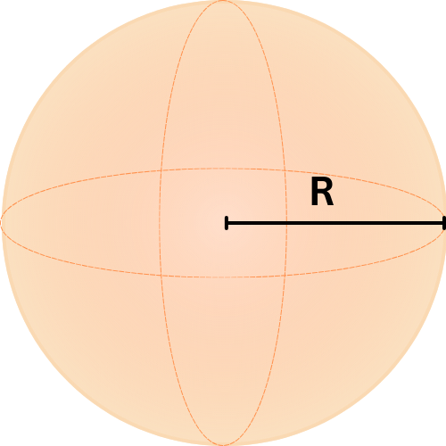
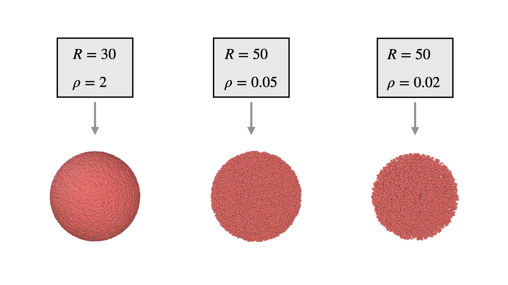

.. _uni-sphere:

===============
A sphere
===============

Structural features
----------------------
1. :math:`R` is the radius of the sphere
2. :math:`\rho` is the density of scatters in scatters (points) per unit volume.

Schematic
-------------------

   
   The illustration of the uniform sphere

Structure Generation
----------------------

We can generate a uniform sphere by sampling a uniform distribution in the box around it, then only including certain scatters.

1. **Define the bounding box**

We frequently use a cube surrounding the sphere. The cube is mathematically defined by 
the bounding box in range :math:`B = [-R, R]^3`

2. **Find the number of points**

We first calculate the number of points that would correspond to the density in the *cube* volume: :math:`(2R)^3 \rho = 8R^3\rho`. 
Since :math:`N` must be an integer, we take the floor of this value to obtain :math:`N = \lfloor 8R^3\rho \rfloor`.

3. **Generate the uniform points in the sphere**

First, we generate a uniform distribution :math:`U_{box}` of scatters within :math:`B` with :math:`N` points

Then we only include scatters that are inside the cube to :math:`U_{sphere}`. Each vector :math:`\mathbf{v} = (x, y, z)` 
in the distribution must satisfy :math:`\Vert \mathbf{v} \Vert \le R`.

Example
----------

   Three examples of uniform spheres, with different densities and radii.

The example above showcases different parameters used to generate these spheres.
The left image contains densely clustered scatters due to its high density, 
while the right image contains spread out scatters due to its lower density.

This structure is generated using :ref:`the Ellipsoid class <ellipsoid-class>`, with :math:`a = c`
